# Garmin Challenge 2021
##### _by Nkateko Senoamadi_

## Introduction

The following document outlines my approach to the Garmin Stellenbosch Challenge 2021.

## The Problem

During a hackathon at Garmin Stellenbosch, you and your teammates are experimenting with sonic sensors for
athletic events like shot-put and javelin. You've managed to put together a system that can transmit a
sound signal at the projectile being thrown, and record the return signal that reflects off it.

Attached are the transmitted signal that is used for all projectiles, and the received signals for a shot-put
and a javelin throw. Can you calculate the speed at which each projectile was thrown?

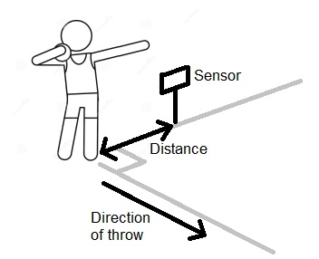

### Given:

* Transmit_1.wav (audio file)

* Shotput_receive_1.wav (audio file)
* Javelin_receive_1.wav (audio file)

## My Approach 
### Determining speed

What we are looking for is the speeds of a shot-put & a javelin given the audio files mentioned above. The solution involves manipulating the Doppler Effect equation in terms of the velocity of the projectile(either shot-put or javelin). The Doppler effect is the change in frequency of a wave in relation to an observer who is moving relative to the wave source.  The general formula is as follows:

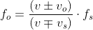

Where:

​	*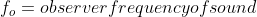

​	*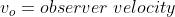

​	*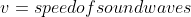

​	*.png)

​	*.png)
​	

We need to identify the **observer** and the __source__ but in order to that we must separate the problem into two parts path 1 and path 2. Path 1 is the path the sound travels from the sensor to the projectile and path 2 is the path the echoed sound travels from the projectile to the sensor:

#### Path 1:

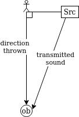

The sound waves leave the sensor and hit the projectile. In this case we have a stationery source and an observer moving away from the source. The modified formula is as follows:

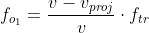

Where:

​	*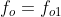 

​	*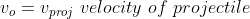

​	*

​	*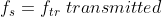

​	*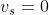

#### Path 2:

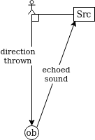

The sound waves echos off the projectile and hits the sensor. In this case we have a stationery observer (the sensor) and source that's moving away from the observer. The modified formula is as follows:

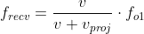

Where:

​	*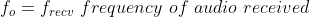

​	*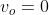

​	*

​	*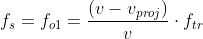

​	*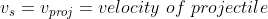

We then substitute and simplify a bit as seen below:

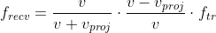

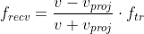

From this point we make the velocity of the projectile the subject of the formula and we get the following:

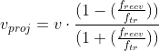

### Processing audio files

Given the derivation it is clear that we must find the the frequency of the transmitted frequency and the received frequency for each projectile. To do this we will use a Discrete Fourier Transform (DFT)  to help us identify the frequencies of the audio files. However, before we can do that we need to process the header of the audio file as seen in the figure below. 

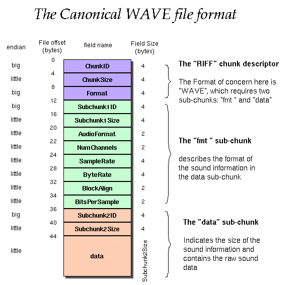

The data is then processed using C++ paying close attention to the changing endians  (with the help of online resources[1] ) and  the data segment of each audio file was stored in a  text file as sample points  separated by newline characters. The output below shows the data extracted from the headers of each audio file.

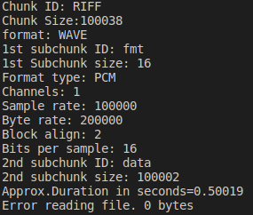

### Getting Frequencies 

The aim is to represent function in the time domain and as functions frequency domain. This is done with the Discrete Fourier Transform (DFT) the data is loaded onto MATLAB and  for the time domain its processed as follows:

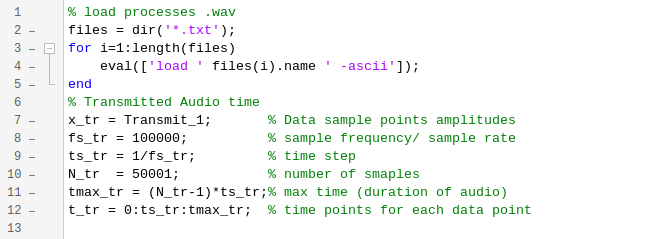

Using the function of the data _x(t)_ (a function of t) we use the Fourier Transform so that i could be represented as _z(f)_ (a function of frequency) .

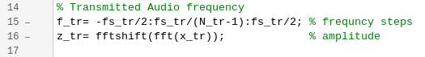

Repeating this for all audio the audio files and graphing  _x(t)_  and  _z(f)_  for the Transmit_1 , Shotput_receive_1 and Javelin_receive_1.  

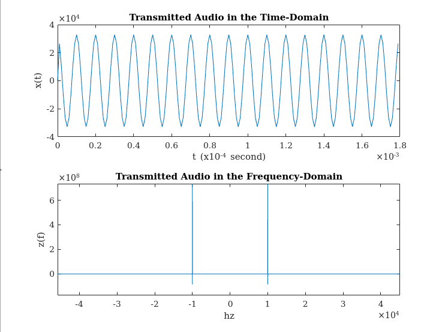

The frequency of the transmitted file is found through getting the absolute value of the frequency  with the largest amplitude ( *z(f)* value ).  

We find that the transmitted frequency is 10 000 Hz.

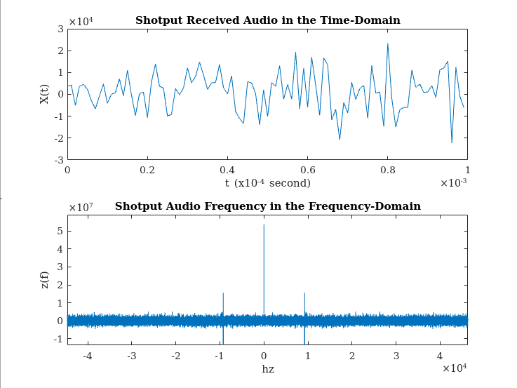

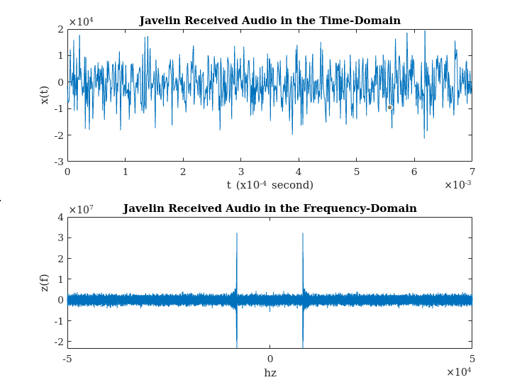

Similarly, we can find the the frequencies of the received audios for each projectile.

We find the received frequency for the shot-put and javelin is 8132 Hz and 9212 Hz respectively.

Applying the formula (derived earlier) in MATLAB we find the speeds of each projectile **relative to the sensor**. Taking the speed of sound as 343 m/s.

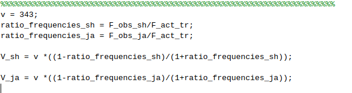

Which gives us the following speeds relative to the sensor :

* _Speed of the shot-put = 14.07 m/s_
* _Speed of the javelin= 35.34 m/s_

## Bibliography

1. File reading : http://truelogic.org/wordpress/2015/09/04/parsing-a-wav-file-in-c/

 